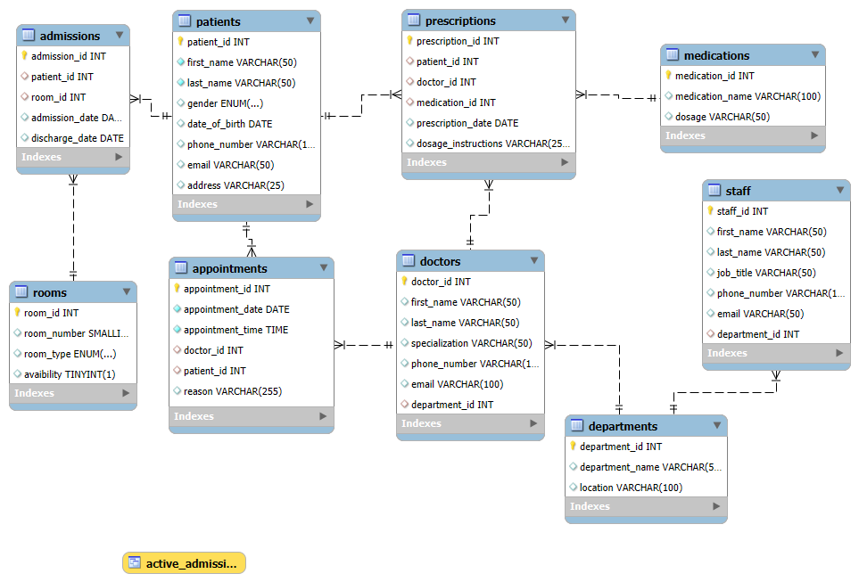

# Hospital Management Database

## **Project Overview**
This project involves the design, implementation, and testing of a comprehensive hospital management database. The system was developed using MySQL and includes features to manage patients, doctors, departments, appointments, medications, prescriptions, admissions, rooms, and staff. 

The database is designed to facilitate efficient management and retrieval of hospital records and data, ensuring scalability and accuracy.

---

## **Key Features**
1. **Database Design**: 
   - A total of 9 interconnected tables from the database schema.
   - Includes well-defined relationships such as One-to-Many and Many-to-Many relations.

2. **Data Insertion**: 
   - Realistic data inserted into each table for testing purposes.

3. **Challenging SQL Queries**:
   - 20 challenges covering CRUD operations, aggregate functions, filtering, grouping, and advanced queries like nested subqueries.
   - Bonus tasks to explore additional use cases such as JOINS.

4. **ERD**:
      Below is the Entity-Relationship Diagram (ERD) of the database structure:

   

5. **Scenarios Addressed**:
   - Patient admission records.
   - Doctor assignments to departments.
   - Prescription and medication management.
   - Tracking appointments and associated doctors.

---

## **Technologies Used**
- **Database Management System**: MySQL
- **Tool for ERD**: MySQL Workbench
- **Programming Language for Queries**: SQL

---

## **Tables in the Database**
1. **Patients**: Stores patient details such as name, gender, contact information, and date of birth.
2. **Doctors**: Includes doctor information like name, specialization, and department affiliation.
3. **Departments**: Contains department details.
4. **Appointments**: Tracks appointments with patients and doctors.
5. **Medications**: Stores information about medications available.
6. **Prescriptions**: Links doctors, patients, and medications.
7. **Admissions**: Tracks patient admissions and associated rooms.
8. **Rooms**: Manages room assignments and availability.
9. **Staff**: Includes non-medical staff details.

---

## **Challenges Completed**
1. CRUD operations for inserting, updating, and deleting records.
2. Aggregate functions like COUNT, SUM, AVG for statistical analysis.
3. Advanced queries using `JOIN`, `GROUP BY`, `HAVING`, and `CASE`.
4. Creation of a view to represent active admissions.

---

## **Project Structure**
- **SQL Files**:
  - `script.sql`: Contains the database schema definition.
  - `insert.sql`: Includes SQL statements for data population.
  - `challenges.sql`: Solutions to 20 challenges and bonus tasks.

- **Documentation**:
  - `README.md`: Project overview and key information.
  - `erd.png`: Visual representation of the database schema (ERD).

---

## **How to Run**
1. Clone the project repository to your local machine.
2. Import the SQL scripts into your MySQL Workbench:
   - Run `script.sql` to create the database and tables.
   - Execute `insert.sql` to populate the tables with test data.
   - Use `challenges.sql` to execute and test the provided queries.
3. Open `erd.png` to understand the database structure
